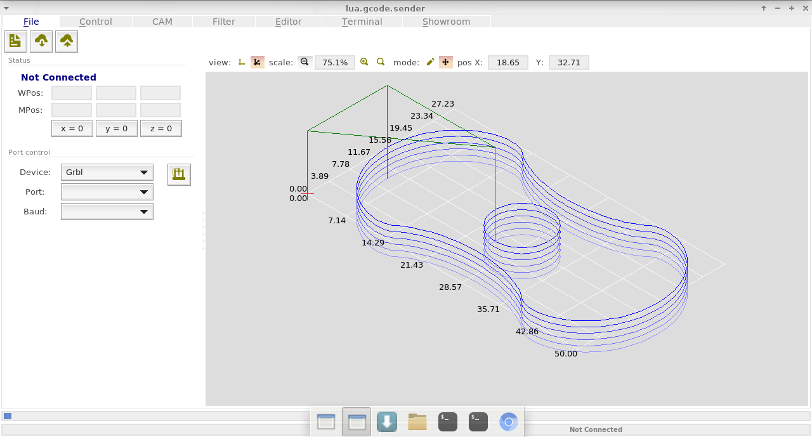
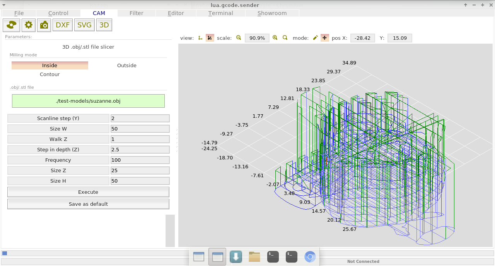
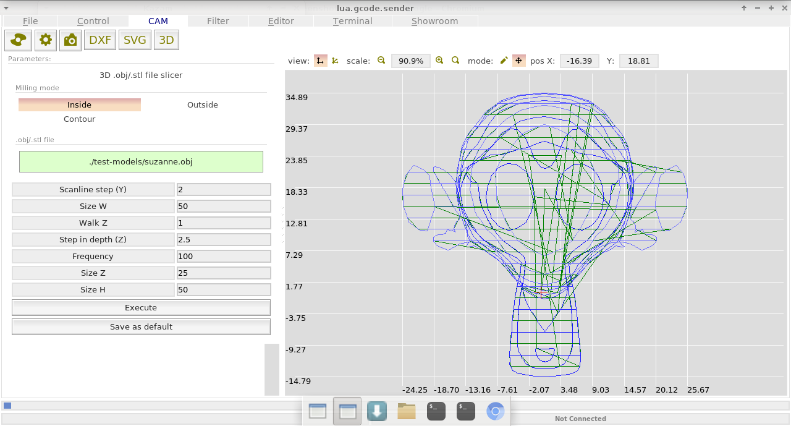
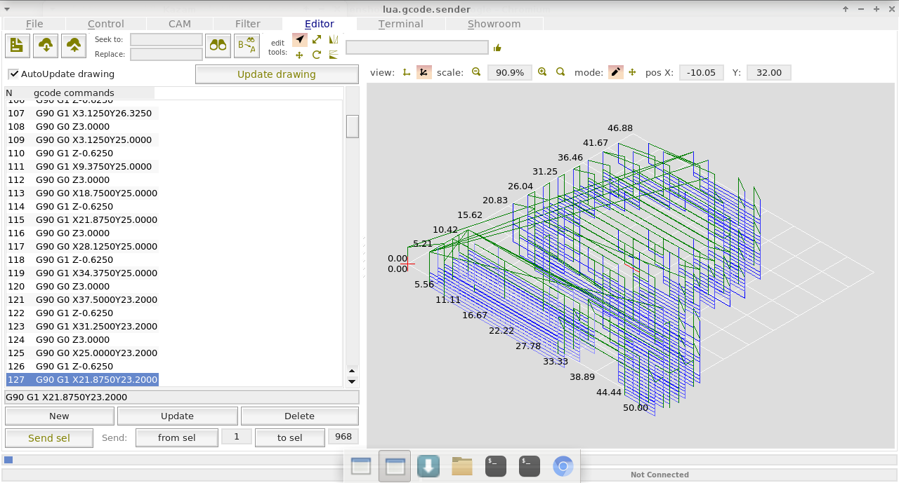
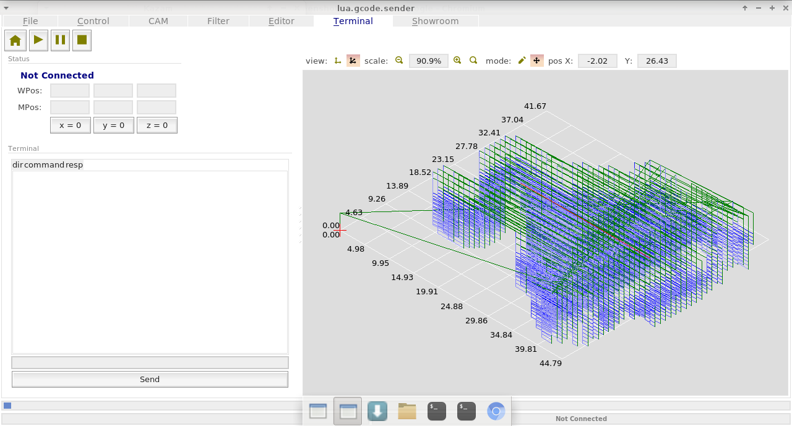
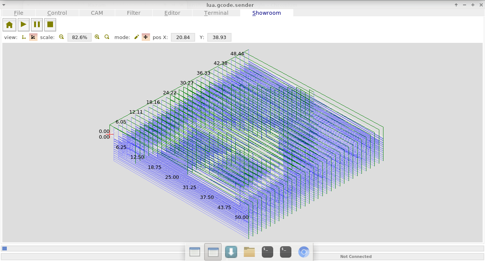

# lua.gcode.sender

Intro
-----
This is a highly configurable and changeable universal g-code sender for home-made CNC, laser & 3d printer. It doesn't contain any hard to port elements.
It has written using Lua & lua modules (lua, C, C++).

Supported hardware
----------
* [GRBL v0.9j](https://github.com/grbl/grbl)
* [Marlin v1 & v2](https://github.com/MarlinFirmware/Marlin/tree/bugfix-2.0.x)

Lua version
------
v5.3.3 (bit operations)

Used Lua plugins
-------
- http://hg.neoscientists.org/tekui/
- https://github.com/keplerproject/luafilesystem
- https://github.com/vsergeev/lua-periphery
- https://github.com/memononen/nanosvg
- https://bitbucket.org/Coin3D/dime (DXF reader library)

Dependencies to build
-------
* libreadline-dev
* libX11-dev
* libxft-dev
* libxext-dev
* libxxf86vm-dev


How to build
-------
Sources of lua-5.3.3 & all modules are included. Just run `bld.sh` script from the top of the project tree:
```sh
$ ./bld.sh 
```
Currently it is tested on linux-arm (Armbian, lUbuntu, Orange Pi PC - raspberry pi like) and linux-x86 (Ubuntu, xUbuntu)

How to execute
-------
```sh
$ cd bld
$ ./prg
```

How to change lua scripts
--------
all lua scripts are in the **bld/conf** folder. examples & docs to lua & modules are in their own folders.


Screenshots
-------












